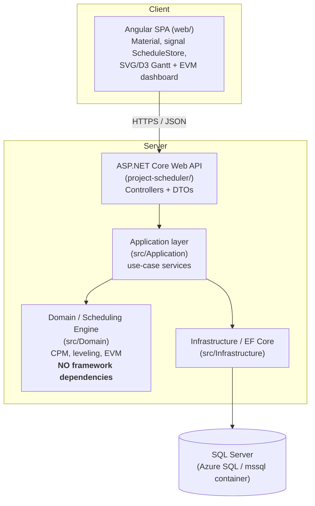
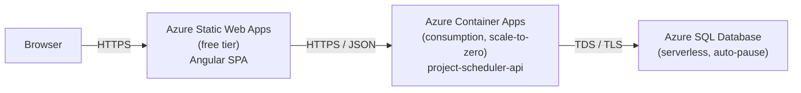

# Architecture

The scheduling engine (`src/Domain`) has zero dependencies on ASP.NET, EF
Core, or Angular. It is unit-tested in `Domain.Tests` with no database, no
HTTP server, and no browser involved — `CpmEngineTests`, `EvmCalculatorTests`,
and `ResourceLevelerTests` all instantiate `ScheduleTask`/`Dependency` objects
directly and call straight into `CpmEngine.Compute`, `EvmCalculator.Compute`,
and `ResourceLeveler.Level`.

## Deployment topology

Three independently deployable pieces, matching the three build artifacts in
this repo: the Angular production build (`web/Dockerfile` /
`dist/web/browser`), the API container (`Dockerfile.api`), and a managed SQL
Server. Locally, `docker-compose.yml` stands in for the same three pieces —
`db`, `api`, `web` — on one machine instead of three Azure resources.

## Why these layer boundaries

- **Domain has no framework dependencies** so the CPM/leveling/EVM math is
  unit-testable in milliseconds, independent of whatever the API or database
  technology happens to be.
- **Application only depends on Domain**, talking to persistence through
  `ISchedulingUnitOfWork` — an interface `Infrastructure` implements. This is
  why every `Application.Tests` test can swap in EF Core's `InMemoryDatabase`
  provider instead of a real SQL Server, and why CI (`.github/workflows/ci.yml`)
  needs no database service container at all.
- **The API is a thin adapter**: controllers map DTOs to Application service
  calls and map results back to DTOs. No scheduling logic lives in a
  controller.
- **The frontend knows nothing about EF Core or the engine's internals** —
  only the JSON contract exposed by the API's DTOs.
