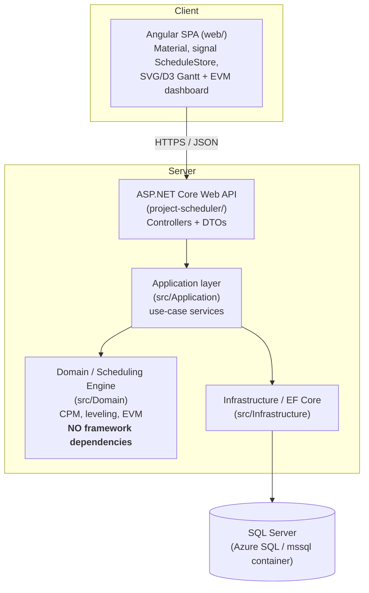

# Project Scheduling & Resource Management App

## Problem

Teams running dependent tasks with shared people can't see what drives the
end date, who's overloaded, or whether they're over budget. This app builds
a task network, computes the critical path and float, levels resources, and
reports Earned Value cost metrics on a live Gantt.

## Architecture

Full diagram, deployment topology, and layer-boundary rationale:
[`ARCHITECTURE.md`](ARCHITECTURE.md).



Plain-text fallback, for anyone reading the raw file instead of GitHub's
rendered Mermaid:

```text
Angular SPA (web/) -- Material, signal-based ScheduleStore, SVG + D3-scale Gantt,
    |                  baseline drift bars, EVM dashboard
    | HTTPS / JSON
    v
ASP.NET Core Web API (project-scheduler/) -- DTOs, controllers, OpenAPI + Scalar UI
    |
    v
Application layer (src/Application) -- AddTaskService, AddDependencyService,
    |                                   RecomputeScheduleService, LevelScheduleService,
    |                                   UpdateTaskProgressService, ComputeEvmService,
    |                                   CaptureBaselineService
    +--> Domain / Scheduling Engine  (CPM forward+backward pass, float,
    |                                  priority-rule resource leveling, EVM) -- NO framework deps
    |
    +--> Infrastructure / EF Core (src/Infrastructure) -- SQL Server LocalDB
```

The scheduling engine (`src/Domain`) is a plain C# class library with zero
framework dependencies, so it can be unit-tested without a database, API, or
UI. The Application layer only depends on Domain too — it talks to
persistence through an `ISchedulingUnitOfWork` interface that `Infrastructure`
implements, so `CpmEngine` stays the only thing that ever touches the engine
outside of `Domain.Tests`.

## Stack

- Engine: plain C# class library (`src/Domain`) — CPM, a priority-rule
  resource leveler, and an `EvmCalculator` (`src/Domain/Cost`)
- Application: use-case services (`src/Application/Scheduling`) orchestrating the engine and persistence
- Tests: xUnit (`tests/Domain.Tests`, `tests/Application.Tests`)
- API: ASP.NET Core Web API (`project-scheduler/`) — DTOs and controllers wired to the Application layer, with an OpenAPI document and a Scalar UI for exploring it
- Frontend: Angular (`web/`) — standalone components, Angular Material, a
  signal-based `ScheduleStore`, an SVG Gantt using a `d3-scale` linear scale
  over project-day with baseline drift bars, a resource histogram flagging
  over-allocation, and an EVM dashboard with status colours
- Data: EF Core + SQL Server LocalDB (`src/Infrastructure`), migrations under `src/Infrastructure/Migrations`

## Status

Built so far:

- `Task`/`Dependency` entities (`src/Domain/Entities`)
- Cycle detection, topological sort, and a CPM engine with forward pass,
  backward pass, total float, free float, and critical-path flagging,
  supporting all four relationship types (FS/SS/FF/SF) with lag
  (`src/Domain/Scheduling`)
- `Domain.Tests` reproducing a hand-worked CPM example (tasks A/B/C/D,
  durations 3/4/2/5, critical path A→B→D), a cycle-rejection test, and a
  relationship-type/lag test — all passing
- `Project` entity and EF Core mapping for `Project`/`ScheduleTask`/`Dependency`
  against SQL Server LocalDB, including the self-referencing `Dependencies`
  table with `Restrict` on both FKs (`src/Infrastructure/Persistence`)
- Application-layer use-case services — `AddTaskService`,
  `AddDependencyService` (rejects cyclic dependencies before they're ever
  persisted), and `RecomputeScheduleService` — plus `Application.Tests`
  proving the worked example survives a full persistence round-trip
  (`src/Application/Scheduling`)
- ASP.NET Core controllers (`ProjectsController`, `TasksController`,
  `DependenciesController`) exposing DTOs over the Application layer, with
  201/400/404/409 mapped from validation and use-case results
- OpenAPI document at `/openapi/v1.json` and a browsable Scalar UI at
  `/scalar/v1`
- End-to-end smoke test: created a project, added tasks A/B/C/D, wired up
  the four FS dependencies, recomputed, and confirmed the persisted
  ES/EF/LS/LF/float/critical values match `Domain.Tests` exactly
- Angular app scaffolded (`web/`) with Angular Material and standalone
  components — no NgModules, no router (one page is the whole Week 3
  deliverable)
- CORS enabled in `Program.cs`, scoped to the Angular dev server origin
  (`http://localhost:4200`)
- TypeScript DTOs mirroring the API's JSON shapes (`web/src/app/core/models`)
  and a thin `SchedulingApiService` wrapping `HttpClient` in
  promise-returning methods (`web/src/app/core/api`)
- A signal-based `ScheduleStore` (`web/src/app/core/state`) holding
  project/task/error state and computed `criticalTaskIds`/`projectDuration`
  — every mutation re-fetches the task list from the API rather than
  recomputing CPM client-side
- Task list with an "add task" form, a dependency editor with a snackbar for
  the 409-cycle case, and an SVG Gantt (linear `d3-scale` over project-day,
  critical path in red), all composed into one `SchedulePage`
  (`web/src/app/features`)
- Browser smoke test: rebuilt the A/B/C/D worked example through the UI
  and confirmed the Gantt bars, critical-path highlighting, and cycle
  rejection all match the curl-driven Week 2 result
- `Resource`/`Assignment` entities and EF Core mapping — `Resources` and
  `Assignments` tables, `Assignments` cascading on `TaskId` and restricting
  on `ResourceId` (`src/Domain/Entities`, `src/Infrastructure/Persistence`)
- `ResourceLeveler`: a priority-list-scheduling heuristic (lowest total float
  first, walking the dependency DAG in topological order, delaying a task
  day-by-day only when an assigned resource is full) that returns leveled
  start/finish dates without mutating the authoritative CPM schedule
  (`src/Domain/Scheduling`)
- `ResourceLevelerTests` extending the A/B/C/D worked example with a
  resource shared by two parallel tasks — proving the leveler both resolves
  a real over-allocation (pushing the project finish from 12 to 14 days) and
  leaves the schedule untouched when capacity is sufficient
- Application-layer `AddResourceService`, `AssignResourceService`, and
  `LevelScheduleService` (`src/Application/Scheduling`), plus
  `ResourcesController` and `AssignmentsController` exposing them over HTTP
- A resource panel (add-resource and assign-resource forms, a "Level
  resources" action with a before/after project-finish summary) and a
  resource histogram (SVG stacked bars per resource per day, red when usage
  exceeds capacity) — the histogram is a client-side aggregation over
  already-fetched data, not a server call, the same way `criticalTaskIds`
  and `projectDuration` are computed (`web/src/app/features`,
  `web/src/app/core/state`)
- Browser smoke test: assigned a capacity-limited resource to two tasks that
  CPM schedules in parallel, confirmed the histogram flags the
  over-allocation, ran leveling, and confirmed both the before/after summary
  (12 → 14 days) and the now-clear histogram match `ResourceLevelerTests`
- `ScheduleTask` gains `Budget` (set once at creation, planning-time),
  `PercentComplete`, and `ActualCost` (updated repeatedly as work
  progresses, status-time) — `Budget`/`ActualCost` mapped as
  `decimal(18,2)` (`src/Domain/Entities`, `src/Infrastructure/Persistence/Configurations`)
- `Baseline` entity storing a point-in-time JSON snapshot of every task's
  `EarlyStart`/`EarlyFinish` (`Baselines` table, cascading on `ProjectId`) —
  a snapshot rather than parallel `BaselineStart`/`BaselineFinish` columns,
  so capturing a second or third baseline needs no schema change
  (`src/Domain/Entities`, `src/Infrastructure/Persistence`)
- `EvmCalculator`: a framework-free static method computing PV (linear
  interpolation of budget across a task's `EarlyStart`/`EarlyFinish` window
  against a status-date project-day), EV (`Budget × PercentComplete`), and
  the AC/SV/CV/SPI/CPI/EAC/ETC/VAC roll-up (`src/Domain/Cost`)
- `EvmCalculatorTests` reproducing a hand-worked EVM table extending the
  same A/B/C/D worked example (BAC 1400, PV 700, EV 740, AC 750 at status
  day 5, EAC ≈1418.92), plus zero-PV and zero-AC edge cases proving SPI/CPI
  come back `0` instead of dividing by zero
- Application-layer `UpdateTaskProgressService`, `ComputeEvmService`, and
  `CaptureBaselineService` (`src/Application/Scheduling`), plus a
  `ComputeEvm_MatchesHandWorkedExample_AfterPersistenceRoundTrip` test
  proving the same hand-worked numbers survive a full persistence
  round-trip through a fresh `DbContext`, the same pattern Week 2
  established for CPM
- New endpoints: `PATCH .../tasks/{id}/progress`, `GET .../evm?asOfDay=`,
  `POST .../baseline`, `GET .../baseline` (`ProjectsController`,
  `TasksController`)
- An `EvmDashboard` feature component — a task-progress form (percent
  complete + actual cost), an "as of day" input with Refresh/Capture
  baseline actions, and a stat grid for BAC/PV/EV/AC/SV/CV/SPI/CPI/EAC/ETC/VAC
  that turns SPI or CPI red below 1.0 — plus a Budget field and column added
  to the task list, since `Budget` is otherwise unreachable from the UI
  (`web/src/app/features/evm-dashboard`, `web/src/app/features/task-list`)
- Baseline drift bars on the Gantt: a `baselineBars` computed signal renders
  a thin grey bar from the captured snapshot beneath each task's current bar
  (`web/src/app/features/gantt-chart`)
- Browser smoke test: captured a baseline on the A/B/C/D network, added
  a new task with a budget and wired it in front of task A (shifting the
  whole network +2 days on recompute), and confirmed the grey baseline bars
  stayed at the original dates while the current bars moved — then drove
  the progress form and confirmed the EVM stat grid matched hand
  computation exactly (EV $75/AC $60/SPI 1.50/CPI 1.25 and, at 10%/$200,
  EV $10/AC $200/SPI 0.20/CPI 0.05 rendering both red)
- Angular environments (`web/src/environments`) replacing a hardcoded
  `http://localhost:5008/api` constant, swapped per build via
  `fileReplacements` in `web/angular.json` — verified by grepping both the
  production and development bundles for the right URL, not just trusting
  the config
- Configurable CORS (`Cors:AllowedOrigins` in `appsettings.json`, read in
  `Program.cs`) instead of a hardcoded dev-only origin, plus a startup
  `Database.Migrate()` call so a brand-new empty database needs no manual
  migration step — verified with real preflight requests (allowed origin
  gets `Access-Control-Allow-Origin` back, an arbitrary origin doesn't) and
  by watching a fresh container build its entire schema from zero on boot
- `Dockerfile.api` (multi-stage SDK → `aspnet` runtime) and `web/Dockerfile`
  (multi-stage `node` → `nginx`, with a `web/nginx.conf` SPA fallback) —
  both built and smoke-tested standalone against a throwaway SQL Server
  container before being wired into compose
- `docker-compose.yml` (`db`/`api`/`web`) for a reproducible local
  full-stack run — verified end-to-end (project creation round-trips
  through SQL Server, a CORS preflight from the web origin succeeds, the
  served bundle points at the compose API URL) and, along the way, caught
  and fixed a stale `ng serve` process that was shadowing port 4200 over
  IPv6 loopback
- `.github/workflows/ci.yml` running the backend (`dotnet build`/`test`,
  Release) and frontend (`npm ci`/`build`/`test`) suites on every push to
  `main` and on every pull request — no database service container needed,
  since `Application.Tests` already runs on EF Core's `InMemoryDatabase`
  provider; confirmed green on a real PR before relying on it
- `tools/Benchmarks`: a framework-free console app timing `CpmEngine.Compute`
  at 100/1,000/10,000 tasks. Running it at 10,000 tasks caught a real bug —
  `CycleDetector`'s recursive DFS overflowed the call stack (a fatal,
  uncatchable crash in .NET) on long dependency chains — fixed by
  converting to an iterative DFS with an explicit heap-allocated stack, and
  regression-tested with 50,000-task acyclic and cyclic chains
  (`CpmEngineTests`)
- `ARCHITECTURE.md`: a Mermaid architecture diagram and a deployment-
  topology diagram, both rendered through `mermaid-cli` and visually
  checked rather than just trusted to parse, plus a `## Metrics` section in
  this README with the real benchmark numbers

Not yet done: cloud deployment (Azure Container Apps / Azure SQL / Static
Web Apps) — ready to run whenever it's worth spending on. See
[Limitations](#limitations) below for everything else still open.

## Metrics

- Engine correctness: 10 `Domain.Tests`, 5 `Application.Tests`, 8 Angular
  spec files — all passing.
- Recompute latency (`tools/Benchmarks`, FS-chain network, p50/p95 over 20
  iterations after 5 discarded warmup iterations, Release build):

  | Tasks  | p50 (ms) | p95 (ms) |
  |--------|----------|----------|
  | 100    | 0.24–0.35 | 0.42–0.70 |
  | 1,000  | 2.60–2.78 | 4.09–5.22 |
  | 10,000 | 12.67–13.42 | 16.17–20.40 |

  Scaling from 1,000 to 10,000 tasks (10x) costs roughly 5x the time, not
  10x — sub-linear, not super-linear, because fixed overhead (list and
  dictionary construction) dominates more at the smaller sizes and amortizes
  as the network grows. `CpmEngine.Compute` is one topological sort plus one
  forward and one backward pass, each a single `O(tasks + dependencies)`
  traversal, so this is the expected shape regardless of network topology,
  not just a property of the chain shape used to generate it.
- Building and running this benchmark at 10,000 tasks caught a real bug:
  `CycleDetector` originally recursed once per task in a dependency chain
  and overflowed the call stack — a fatal, uncatchable crash in .NET — on
  networks with a few thousand sequentially-dependent tasks. Fixed by
  converting to an iterative DFS with an explicit heap-allocated stack;
  regression-tested with a 50,000-task acyclic chain and a 50,000-task chain
  with a cycle at the far end (`CpmEngineTests`).
- Resource leveling: the A/B/C/D network with a shared, capacity-limited
  resource goes from a 12-day to a 14-day project finish once leveled
  (`ResourceLevelerTests`).
- End-to-end latency, "add dependency" → Gantt re-renders: not formally
  profiled; anecdotally sub-100ms against a local API in manual browser
  testing. Flagged here rather than asserted as a real number, the same way
  the leveler is flagged as a heuristic rather than claimed optimal.

## Limitations

- **Working-day calendars aren't modeled.** The Gantt's x-axis is still
  linear project-day offsets, not calendar dates — no weekends, no
  holidays.
- **No Gantt dependency connector arrows.** Dependencies are visible in the
  dependency editor and drive the computed dates, but aren't drawn as
  lines between bars.
- **No project picker or routing.** The Angular app is hardcoded to one
  `PROJECT_ID` constant (`web/src/app/features/schedule-page/schedule-page.ts`).
  There's no multi-tenant story, no auth, and no way to switch projects from
  the UI — an explicit, stated scope decision for this project, not an
  oversight.
- **Not deployed to the cloud yet.** `docker-compose.yml` proves the full
  stack works together; Azure Container Apps / Azure SQL / Static Web Apps
  deployment hasn't been run yet.
- **Startup auto-migration isn't safe for multiple instances.** `Program.cs`
  calls `Database.Migrate()` on every boot so a fresh database needs no
  manual step — fine for a single-instance demo, but two instances starting
  concurrently against an empty database would race on the migration. A
  real multi-instance deployment needs a separate one-shot migration step,
  not this.
- **Resource leveling is a heuristic, not an optimizer.** Lowest-total-float-
  first with day-by-day capacity checks — documented and tested
  (`ResourceLevelerTests`), but not claimed to be optimal.

## How to Run

### Local (no Docker)

```bash
# Run all tests
dotnet test tests/Domain.Tests/Domain.Tests.csproj
dotnet test tests/Application.Tests/Application.Tests.csproj

# Apply migrations to a local SQL Server LocalDB instance (fresh clone / first run)
dotnet tool install --global dotnet-ef   # only needed once per machine
dotnet ef database update --project src/Infrastructure --startup-project project-scheduler

# Run the API
dotnet run --project project-scheduler
```

With the API running, open `http://localhost:5008/scalar/v1` (or the HTTPS
URL from `project-scheduler/Properties/launchSettings.json`) for a browsable,
self-documenting view of every endpoint.

```bash
# Run the Angular app (first time: cd web && npm install)
cd web
npm start
```

The API and the Angular dev server (`http://localhost:4200`) both need to be
running at the same time in development — the SPA calls the API over HTTP,
and `Program.cs` only allows CORS requests from origins listed under
`Cors:AllowedOrigins` in `appsettings.json` (`http://localhost:4200` by
default), so the dev server has to be up for the browser to be able to
reach the API at all.

### Local (Docker Compose)

```bash
docker compose up --build
```

Then open `http://localhost:4200`. No manual migration step — the `api`
container migrates its database on startup, even against the `db`
container's completely empty first-run volume. `web/src/environments/
environment.production.ts`'s `apiBaseUrl` needs to point at
`http://localhost:8080/api` for this to work, since the browser runs on
your host machine, not inside the compose network — the compose service
name `api` means nothing to it. That file currently holds a placeholder for
the (not-yet-executed) cloud deployment instead; swap it before using
compose, matching what `docker-compose.yml`'s comments describe.

### Deployed

Not yet — see [Limitations](#limitations) above. Planned topology: Azure
Container Apps for the API, Azure SQL Database serverless, and Azure
Static Web Apps for the frontend, whenever it's worth spending on.
