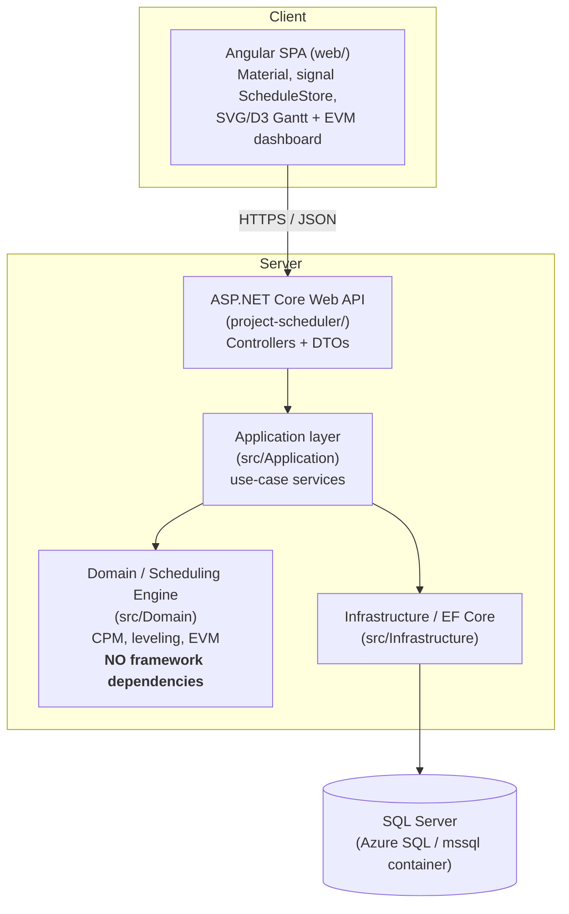

# Week 6 Walkthrough: Deploy, Harden, and Polish

This is the implementation guide for Week 6 of the six-week plan in
[`project-scheduler/Project_Scheduling_App_Project_Pack.md`](../project-scheduler/Project_Scheduling_App_Project_Pack.md)
(section 5, "Week 6: Deploy, harden, and polish"). It's written against the
codebase as it stands at the end of Week 5 (`README.md` "Status: Week 5"):
the CPM engine, resource leveling, and EVM/baseline layers are all built,
tested, and browser-verified. Nothing about scheduling logic changes this
week — every task here is about making the thing runnable outside your own
machine, and proving it with numbers instead of vibes.

## Recap: what Week 6 delivers

From the project pack:

- Goal: Dockerize, add docker compose, add GitHub Actions; deploy API + DB +
  frontend to the cloud; write the README with the metrics table and
  record a demo.
- Deliverables: deployed public demo, CI running build + tests, README +
  architecture diagram + short demo video.
- Must be able to explain: your deployment topology and rough cost, how
  secrets/connection strings are handled, where the system would fail at
  scale.

Current state, confirmed before writing a line of infra code: 8
`Domain.Tests`, 5 `Application.Tests`, 8 Angular spec files — all passing.
`dotnet build` and `ng build` are both clean.

## Two gaps to close before Dockerizing anything

Two things in the current code only work because everything has always run
on one machine. Both will break silently the moment the API and the SPA run
in separate containers, so they're Task 1 and Task 2, before any Dockerfile
gets written:

1. **`web/src/app/core/api/scheduling-api.service.ts`** hardcodes
   `const API_BASE_URL = 'http://localhost:5008/api';`. A production Angular
   build with this constant baked in would ship pointing at `localhost` no
   matter where it's actually deployed.
2. **`project-scheduler/Program.cs`** hardcodes the CORS policy to
   `.WithOrigins("http://localhost:4200")`. A deployed API would reject every
   request from a deployed frontend origin.

Fix both before Docker, so the images you build are the same images you
deploy — not "works in the container, breaks in the cloud."

## Build order and why

1. Angular environment config (fixes gap 1).
2. Configurable CORS (fixes gap 2).
3. Dockerize the API.
4. Dockerize the Angular app.
5. `docker-compose.yml` for a reproducible local full-stack run.
6. GitHub Actions CI (build + test on every push).
7. A performance benchmark for the metrics table.
8. `ARCHITECTURE.md` (Mermaid diagram) + README metrics section.
9. Deploy to Azure (API, database, frontend).
10. Record the demo, finalize the README.
11. Verify everything end-to-end and check off the "must be able to explain" list.

---

## Task 1 — Angular environment configuration

**New files:**

`web/src/environments/environment.ts`:

```typescript
export const environment = {
  production: false,
  apiBaseUrl: 'http://localhost:5008/api',
};
```

`web/src/environments/environment.production.ts`:

```typescript
export const environment = {
  production: true,
  apiBaseUrl: 'https://REPLACE-WITH-YOUR-CONTAINER-APP-URL/api',
};
```

(You won't know the real Container App URL until Task 9. Leave the
placeholder for now — you'll come back and fill it in, then rebuild.)

**File:** `web/angular.json` — add `fileReplacements` to the `production`
build configuration (same builder, this option works with the new
`@angular/build:application` builder too):

```json
"production": {
  "budgets": [ ... ],
  "outputHashing": "all",
  "fileReplacements": [
    {
      "replace": "src/environments/environment.ts",
      "with": "src/environments/environment.production.ts"
    }
  ]
}
```

**File:** `web/src/app/core/api/scheduling-api.service.ts` — replace the
hardcoded constant:

```typescript
import { environment } from '../../../environments/environment';
// ...
const API_BASE_URL = environment.apiBaseUrl;
```

Rebuild both configurations to prove the replacement actually happens:

```bash
cd web
npm run build                              # production config, hits environment.production.ts
npx ng build --configuration development   # dev config, hits environment.ts
```

Grep the production output to confirm the real URL made it into the
bundle and `localhost:5008` didn't:

```bash
grep -o "REPLACE-WITH-YOUR-CONTAINER-APP-URL\|localhost:5008" dist/web/browser/main-*.js
```

---

## Task 2 — Configurable CORS

**File:** `project-scheduler/appsettings.json` — add a configurable origin
list instead of the hardcoded dev origin:

```json
{
  "Logging": { "...": "..." },
  "AllowedHosts": "*",
  "Cors": {
    "AllowedOrigins": ["http://localhost:4200"]
  }
}
```

**File:** `project-scheduler/Program.cs` — read the list instead of a
literal string:

```csharp
var allowedOrigins = builder.Configuration.GetSection("Cors:AllowedOrigins").Get<string[]>()
    ?? ["http://localhost:4200"];

builder.Services.AddCors(options =>
    options.AddPolicy(AngularDevCors, policy => policy
        .WithOrigins(allowedOrigins)
        .AllowAnyHeader()
        .AllowAnyMethod()));
```

This means the deployed Container App can add its Static Web App origin via
an environment variable (`Cors__AllowedOrigins__0`) without touching code —
the same double-underscore convention ASP.NET Core uses for any nested
config key from an env var.

While you're in `Program.cs`, add one more thing that Task 5 depends on —
migrate the database on startup, right before `app.Run()`:

```csharp
using (var scope = app.Services.CreateScope())
{
    scope.ServiceProvider.GetRequiredService<SchedulingDbContext>().Database.Migrate();
}

app.Run();
```

This removes the "did you remember to run `dotnet ef database update`
against the container" footgun for a docker-compose demo or a fresh cloud
deploy. Be ready to explain the trade-off: auto-migrate-on-startup is fine
for a single-instance demo, but two instances starting concurrently against
the same empty database would race on the migration — a real multi-instance
production deployment would need a migration job that runs once, separately
from application startup.

---

## Task 3 — Dockerize the API

**File:** `.dockerignore` (repo root) — keep the build context small and
never let it inhale secrets:

```text
**/bin/
**/obj/
**/node_modules/
**/.vs/
**/.git/
web/dist/
.env
```

**File:** `Dockerfile.api` (repo root, not under `project-scheduler/` — the
build needs `src/` in scope too, and putting it at the root next to
`docker-compose.yml` keeps that obvious):

```dockerfile
FROM mcr.microsoft.com/dotnet/sdk:10.0 AS build
WORKDIR /src

COPY project-scheduler/project-scheduler.csproj project-scheduler/
COPY src/Domain/Domain.csproj src/Domain/
COPY src/Application/Application.csproj src/Application/
COPY src/Infrastructure/Infrastructure.csproj src/Infrastructure/
RUN dotnet restore project-scheduler/project-scheduler.csproj

COPY project-scheduler/ project-scheduler/
COPY src/ src/
RUN dotnet publish project-scheduler/project-scheduler.csproj -c Release -o /app/publish --no-restore

FROM mcr.microsoft.com/dotnet/aspnet:10.0 AS runtime
WORKDIR /app
COPY --from=build /app/publish .
ENV ASPNETCORE_URLS=http://+:8080
EXPOSE 8080
ENTRYPOINT ["dotnet", "project-scheduler.dll"]
```

Copying `.csproj` files first and restoring before copying the rest of the
source is deliberate layer-caching: as long as no `.csproj` changed, Docker
reuses the restored-packages layer on every rebuild instead of re-pulling
NuGet packages.

Build and smoke-test it standalone (no compose yet, just to prove the image
runs):

```bash
docker build -f Dockerfile.api -t project-scheduler-api .
docker run --rm -p 8080:8080 -e ConnectionStrings__Scheduling="Server=host.docker.internal,1433;Database=ProjectScheduler;User Id=sa;Password=<your-local-sql-password>;TrustServerCertificate=True" project-scheduler-api
curl http://localhost:8080/api/projects/1
```

(You need *some* SQL Server reachable here — either your existing LocalDB
exposed via `host.docker.internal`, or just skip straight to Task 5's
compose stack, which brings its own database container.)

---

## Task 4 — Dockerize the Angular app

**File:** `web/nginx.conf`:

```nginx
server {
    listen 80;
    server_name _;
    root /usr/share/nginx/html;
    index index.html;

    location / {
        try_files $uri $uri/ /index.html;
    }
}
```

(There's no router yet — one page is the whole app — but `try_files ...
/index.html` is the standard SPA fallback and costs nothing to have ready
for when routing lands.)

**File:** `web/Dockerfile`:

```dockerfile
FROM node:22-alpine AS build
WORKDIR /app
COPY package.json package-lock.json ./
RUN npm ci
COPY . .
RUN npm run build

FROM nginx:alpine AS runtime
COPY --from=build /app/dist/web/browser /usr/share/nginx/html
COPY nginx.conf /etc/nginx/conf.d/default.conf
EXPOSE 80
```

`dist/web/browser` is exactly the output path you already saw from
`npm run build` in Week 5 — same command, just running inside the image
now.

---

## Task 5 — `docker-compose.yml` for a reproducible local run

**File:** `.env` (repo root — add this filename to `.gitignore`, it holds a
password):

```text
MSSQL_SA_PASSWORD=Your_str0ng_Passw0rd!
```

**File:** `docker-compose.yml` (repo root):

```yaml
services:
  db:
    image: mcr.microsoft.com/mssql/server:2022-latest
    environment:
      ACCEPT_EULA: "Y"
      MSSQL_SA_PASSWORD: ${MSSQL_SA_PASSWORD}
    ports:
      - "1433:1433"
    volumes:
      - mssql-data:/var/opt/mssql

  api:
    build:
      context: .
      dockerfile: Dockerfile.api
    depends_on:
      - db
    environment:
      ConnectionStrings__Scheduling: "Server=db;Database=ProjectScheduler;User Id=sa;Password=${MSSQL_SA_PASSWORD};TrustServerCertificate=True"
      Cors__AllowedOrigins__0: "http://localhost:4200"
    ports:
      - "8080:8080"

  web:
    build:
      context: web
    ports:
      - "4200:80"

volumes:
  mssql-data:
```

The one subtlety worth being explicit about, because it's a real footgun:
**the API's connection string uses the compose service name `db`, but the
Angular bundle's `API_BASE_URL` must use `http://localhost:8080/api`, not
`http://api:8080/api`.** The API-to-database call happens container-to-
container inside the compose network, where service names resolve. The
browser's calls to the API happen from your host machine, completely
outside that network — `api` means nothing to your browser's DNS
resolution. This is exactly why Task 1's environment file is a separate,
rebuildable file: the Angular image built for this compose stack should
target `http://localhost:8080/api`, and the Angular image built for the
real cloud deploy in Task 9 targets the Container App's public URL — same
build process, different environment file contents.

Add `.gitignore`: `.env`.

Run it and prove the whole stack round-trips before moving on:

```bash
docker compose up --build
curl -X POST http://localhost:8080/api/projects -H "Content-Type: application/json" -d "{\"name\":\"Compose Smoke Test\",\"startDate\":\"2026-01-01\"}"
```

Open `http://localhost:4200` — because of the startup migration from Task 2,
there's no separate `dotnet ef database update` step against this
container; the schema is created the first time the `api` container starts.

---

## Task 6 — GitHub Actions CI

**File:** `.github/workflows/ci.yml`:

```yaml
name: CI

on:
  push:
    branches: [main]
  pull_request:

jobs:
  backend:
    runs-on: ubuntu-latest
    steps:
      - uses: actions/checkout@v4
      - uses: actions/setup-dotnet@v4
        with:
          dotnet-version: "10.0.x"
      - run: dotnet restore project-scheduler.slnx
      - run: dotnet build project-scheduler.slnx --no-restore -c Release
      - run: dotnet test tests/Domain.Tests/Domain.Tests.csproj --no-build -c Release
      - run: dotnet test tests/Application.Tests/Application.Tests.csproj --no-build -c Release

  frontend:
    runs-on: ubuntu-latest
    defaults:
      run:
        working-directory: web
    steps:
      - uses: actions/checkout@v4
      - uses: actions/setup-node@v4
        with:
          node-version: "22"
          cache: "npm"
          cache-dependency-path: web/package-lock.json
      - run: npm ci
      - run: npm run build
      - run: npm test -- --watch=false
```

No database service container is needed for `backend` — worth noticing and
worth being able to explain: `Application.Tests` already runs against EF
Core's `UseInMemoryDatabase` provider (see `SchedulingServicesTests.
CreateContext`), the same reason the whole engine is unit-testable without
a database in the first place. CI just inherits that property for free.

Push a branch and confirm both jobs go green in the Actions tab before
relying on this gate for anything.

**Optional/stretch** (the pack lists lint under the "Better" tier, not the
core Week 6 goal — this repo has no linter configured yet, so treat this as
a follow-up, not a blocker):

```bash
# Backend formatting check
dotnet format --verify-no-changes

# Frontend lint (one-time setup, then wire into the workflow above)
cd web && ng add @angular-eslint/schematics
ng lint
```

---

## Task 7 — A performance benchmark for the metrics table

The pack asks for recompute latency at 100/1,000/10,000 tasks, confirming
roughly linear scaling. Add a small, framework-free console app rather than
folding timing code into `Domain.Tests` — a benchmark isn't a pass/fail
assertion, it's a number you read.

**File:** `tools/Benchmarks/Benchmarks.csproj` (new):

```xml
<Project Sdk="Microsoft.NET.Sdk">

  <PropertyGroup>
    <OutputType>Exe</OutputType>
    <TargetFramework>net10.0</TargetFramework>
    <ImplicitUsings>enable</ImplicitUsings>
    <Nullable>enable</Nullable>
  </PropertyGroup>

  <ItemGroup>
    <ProjectReference Include="..\..\src\Domain\Domain.csproj" />
  </ItemGroup>

</Project>
```

**File:** `tools/Benchmarks/Program.cs` (new):

```csharp
using System.Diagnostics;
using Domain.Entities;
using Domain.Scheduling;

const int Iterations = 20;
int[] sizes = [100, 1_000, 10_000];

Console.WriteLine($"{"Tasks",8} | {"p50 (ms)",10} | {"p95 (ms)",10}");

foreach (var size in sizes)
{
    var (tasks, dependencies) = BuildChain(size);
    var timings = new List<double>(Iterations);

    for (var i = 0; i < Iterations; i++)
    {
        foreach (var task in tasks)
        {
            task.EarlyStart = task.EarlyFinish = task.LateStart = task.LateFinish = 0;
        }

        var stopwatch = Stopwatch.StartNew();
        CpmEngine.Compute(tasks, dependencies);
        stopwatch.Stop();
        timings.Add(stopwatch.Elapsed.TotalMilliseconds);
    }

    timings.Sort();
    var p50 = timings[Iterations / 2];
    var p95 = timings[(int)(Iterations * 0.95) - 1];
    Console.WriteLine($"{size,8} | {p50,10:F3} | {p95,10:F3}");
}

static (List<ScheduleTask> tasks, List<Dependency> dependencies) BuildChain(int size)
{
    var tasks = new List<ScheduleTask>(size);
    var dependencies = new List<Dependency>(size - 1);

    for (var i = 1; i <= size; i++)
    {
        tasks.Add(new ScheduleTask { Id = i, Name = $"T{i}", Duration = 1 });
    }

    for (var i = 2; i <= size; i++)
    {
        dependencies.Add(new Dependency { Id = i - 1, PredecessorId = i - 1, SuccessorId = i });
    }

    return (tasks, dependencies);
}
```

A single long FS chain (task *i* depends only on task *i-1*) is the
simplest network to generate and reason about, and it's not a cherry-picked
easy case: `CpmEngine.Compute` is `O(tasks + dependencies)` regardless of
shape (one topological sort, one forward pass, one backward pass, each a
single traversal), so a chain and a denser DAG with the same task/dependency
counts should cost about the same. Say exactly that when asked why you
didn't generate a "more realistic" branching network.

Add it to the solution and run it:

```xml
<!-- project-scheduler.slnx -->
<Project Path="tools/Benchmarks/Benchmarks.csproj" />
```

```bash
dotnet run -c Release --project tools/Benchmarks/Benchmarks.csproj
```

Copy the real numbers this prints — not placeholders — into the README's
metrics table in Task 8.

---

## Task 8 — `ARCHITECTURE.md` and the README metrics section

**File:** `ARCHITECTURE.md` (repo root, new). Mermaid renders natively in
GitHub's markdown viewer, so it's the diagram with the least tooling
overhead — no Excalidraw/draw.io export step, no `docs/architecture.png`
binary to keep in sync with the text around it.

````markdown
# Architecture



The scheduling engine (`src/Domain`) has zero dependencies on ASP.NET, EF
Core, or Angular. It is unit-tested in `Domain.Tests` with no database, no
HTTP server, and no browser involved.
````

Embed it at the top of `README.md`'s Architecture section, above the
existing text-diagram block (keep the text block too — GitHub renders
Mermaid, but a plain-text fallback costs nothing and helps anyone reading
the raw file).

**File:** `README.md` — add a `## Metrics` section using Task 7's real
output and the leveling numbers already established in `ResourceLevelerTests`
(Week 4: 12 → 14 days):

```markdown
## Metrics

- Engine correctness: 8 `Domain.Tests`, 5 `Application.Tests`, 8 Angular
  spec files — all passing.
- Recompute latency (`tools/Benchmarks`, chain network, p50/p95 over 20
  iterations):

  | Tasks  | p50 (ms) | p95 (ms) |
  |--------|----------|----------|
  | 100    | ...      | ...      |
  | 1,000  | ...      | ...      |
  | 10,000 | ...      | ...      |

- Resource leveling: the section 1.4 network with a shared, capacity-limited
  resource goes from a 12-day to a 14-day project finish once leveled
  (`ResourceLevelerTests`).
- End-to-end latency, "add dependency" → Gantt re-renders: not formally
  profiled; anecdotally sub-100ms against a local API in manual browser
  testing. Flagged here rather than asserted as a real number, the same way
  the leveler is flagged as a heuristic rather than claimed optimal.
```

Fill in the three `...` cells with your actual benchmark run — don't leave
placeholder numbers in a committed README.

---

## Task 9 — Deploy to Azure

Azure is the natural fit here specifically *because* this project already
committed to SQL Server (`UseSqlServer` in `SchedulingDbContext`) rather
than Postgres — Azure SQL is the same engine, not a migration.

This section spends real money once you run it. Read it, decide your
budget, then execute — nothing here has been provisioned on your behalf.

```bash
# 1. Resource group
az group create --name project-scheduler-rg --location eastus

# 2. Azure SQL — serverless, auto-pauses after an hour idle
az sql server create --name ps-sql-<your-unique-suffix> \
  --resource-group project-scheduler-rg --location eastus \
  --admin-user psadmin --admin-password "<generate one, store it in a password manager>"

az sql db create --resource-group project-scheduler-rg --server ps-sql-<your-unique-suffix> \
  --name ProjectScheduler --edition GeneralPurpose --family Gen5 --capacity 1 \
  --compute-model Serverless --auto-pause-delay 60

az sql server firewall-rule create --resource-group project-scheduler-rg \
  --server ps-sql-<your-unique-suffix> --name AllowAzureServices \
  --start-ip-address 0.0.0.0 --end-ip-address 0.0.0.0

# 3. Container Apps environment + the API, built straight from Dockerfile.api
az containerapp env create --name ps-env --resource-group project-scheduler-rg --location eastus

az containerapp up --name ps-api --resource-group project-scheduler-rg \
  --environment ps-env --source . --dockerfile Dockerfile.api \
  --target-port 8080 --ingress external

# Connection string as a secret, never as a plain env var or in appsettings.json
az containerapp secret set --name ps-api --resource-group project-scheduler-rg \
  --secrets scheduling-connection-string="Server=tcp:ps-sql-<your-unique-suffix>.database.windows.net,1433;Database=ProjectScheduler;User ID=psadmin;Password=<same password>;Encrypt=True;TrustServerCertificate=False;"

az containerapp update --name ps-api --resource-group project-scheduler-rg \
  --set-env-vars \
    "ConnectionStrings__Scheduling=secretref:scheduling-connection-string" \
    "Cors__AllowedOrigins__0=https://<your-static-web-app-name>.azurestaticapps.net"
```

For the frontend, the Azure Portal's "Static Web Apps" create wizard,
pointed at your GitHub repo, is genuinely easier than the CLI here — it
generates its own GitHub Actions workflow that builds `web/` and deploys
`dist/web/browser` on every push, which is exactly the CI-for-frontend
Task 6 didn't already cover. Point the app location at `web`, the output
location at `dist/web/browser`.

Once the Container App has a real URL, go back and fill in Task 1's
`environment.production.ts` with it, and fill in the CORS origin above with
the real Static Web Apps URL — the two deploys reference each other's
addresses, so there's an unavoidable "deploy once, update the other side,
redeploy" step here. Say so if asked; it's not a mistake, it's the shape of
deploying two services that need each other's URLs.

**Rough cost** (say this number out loud in an interview — it's a real
answer, not a guess):

- Container Apps consumption plan: scales to zero, roughly $0 idle, low
  cents per request under light demo traffic.
- Azure SQL Serverless, auto-paused: near $0 while paused; a few dollars a
  month if actively queried for a few hours a day.
- Static Web Apps Free tier: $0.
- Expect low single-digit dollars per month for a portfolio demo you pause
  or delete between uses — not a "leave it running forever" number.

---

## Task 10 — Record the demo, finalize the README

90-second script, the same shape as the pack's compressed-plan demo script,
extended with what Weeks 4–5 added:

1. Open the deployed Static Web Apps URL.
2. Add tasks A/B/C/D with budgets, wire the four FS dependencies — watch the
   critical path highlight and recompute live.
3. Assign a resource to two parallel tasks, show the histogram flag the
   over-allocation, click Level — show the before/after project-finish
   summary.
4. Capture a baseline, add one more task that shifts the schedule, recompute
   — show the grey baseline bar staying put while the current bar moves.
5. Update a task's percent complete and actual cost, refresh the EVM
   dashboard — show SPI/CPI, and a stat flipping red if you push a number
   below 1.0.

**File:** `README.md` — final pass matching the pack's outline (section
4.13): Problem → Architecture (Mermaid embed) → Stack → Metrics →
Limitations → How to Run. Update "How to Run" with three real paths now
instead of one:

```markdown
## How to Run

### Local (no Docker)
... existing dotnet run / npm start instructions ...

### Local (Docker Compose)
\`\`\`bash
docker compose up --build
\`\`\`
Then open http://localhost:4200. No manual migration step — the API
container migrates its database on startup.

### Deployed
- Frontend: https://<your-static-web-app-name>.azurestaticapps.net
- API: https://<your-container-app-url> (Scalar UI at `/scalar/v1`)
```

Add a `## Limitations` section if one doesn't already exist, folding in the
existing "Not yet built" line plus anything Week 6 didn't touch: working-day
calendars, Gantt dependency connector arrows, a project picker/routing (the
UI is still hardcoded to one project ID), and the migration-on-startup
caveat from Task 2.

---

## Task 11 — Verify, then check the "must be able to explain" list

Verification, in order:

- `docker compose up --build` from a clean checkout, then drive the app
  through a browser at `http://localhost:4200` — this is the thing to
  actually click through yourself, not just trust because the containers
  started.
- Push to a branch, confirm both CI jobs (`backend`, `frontend`) go green in
  the GitHub Actions tab.
- Hit the deployed Static Web Apps URL from a machine that isn't yours (or
  at least a fresh incognito window) and run the same click-through as the
  demo script in Task 10.
- Re-read `README.md` top to bottom as if you'd never seen this repo before
  — does "How to Run" actually work as written, for all three paths?

From the pack's Week 6 "must be able to explain" list, answerable directly
from what you just built:

- **Your deployment topology and rough cost.** Static Web Apps (frontend,
  free) → Container Apps (API, consumption/scale-to-zero) → Azure SQL
  (serverless, auto-pause). Low single-digit dollars a month if you pause
  or delete resources between demos.
- **How secrets/connection strings are handled.** Never in `appsettings.json`
  or a Dockerfile `ENV` line — the SQL connection string is a Container Apps
  secret referenced via `secretref:`, injected as `ConnectionStrings__Scheduling`
  through ASP.NET Core's standard double-underscore env-var-to-config-key
  convention. Locally, the same shape comes from `.env` (gitignored) feeding
  docker-compose's `environment:` block.
- **Where the system would fail at scale.** Two concrete, honest answers,
  not hand-waving: (1) the startup `Database.Migrate()` call from Task 2
  isn't safe for more than one API instance starting concurrently against an
  empty database — a real multi-instance deploy needs a separate one-shot
  migration step; (2) the app is still hardcoded to a single project ID
  end-to-end (`SchedulePage`'s `PROJECT_ID` constant) — there's no
  multi-tenant story, no auth, and no project picker, which is an explicit,
  stated non-goal of this project (section 0 of the pack), not an oversight.
